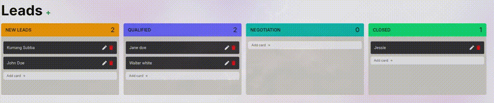
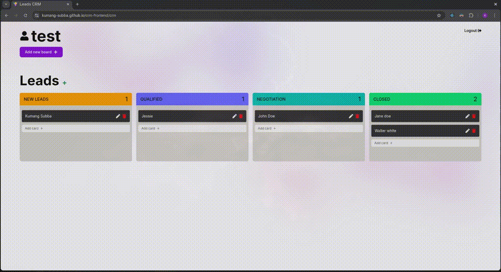

# CRM Frontend

Frontend application for a CRM system.

## Features

- User authentication and authorization (via backend API)
- Lead management: view, move between stages, reorder
- Board and column management to configure custom sales pipelines
- Clean modular architecture with reusable components

## Preview


Moving leads to different columns


Managing leads and columns

## Running Locally

1. Clone the repository

   ```bash
   git clone https://github.com/kumang-subba/crm-frontend.git
   cd crm-frontend
   ```

2. Install dependencies and run the app

```bash
   npm install
   npm run dev
```

The app should be running on [http://localhost:5173/](http://localhost:5173/) by default.
